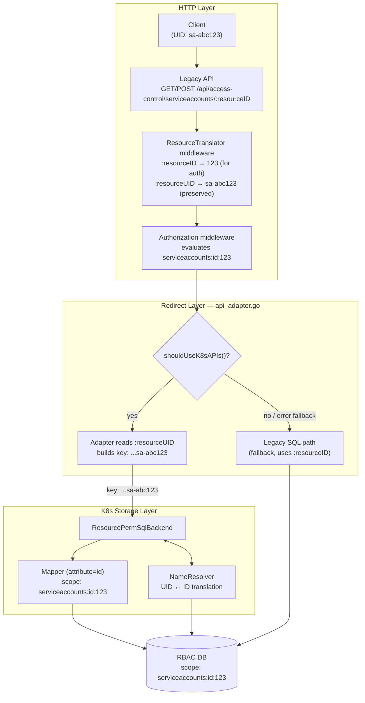
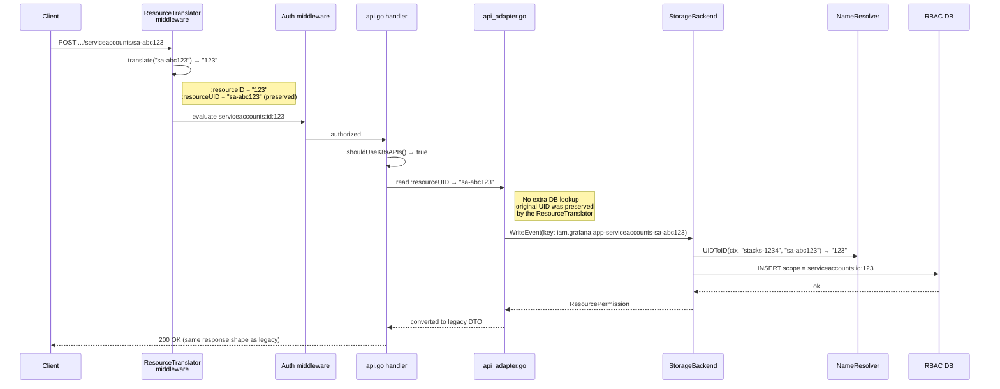

# Service Account ResourcePermission K8s API Support

## Context

The K8s `ResourcePermission` API (`iam.grafana.app/v0alpha1`) already supports **folders** and **dashboards** as managed resources. Service accounts (`serviceaccounts`) need to be wired in similarly so that the `GET/POST /api/access-control/serviceaccounts/{resourceID}` endpoints can read and write permissions via the K8s storage backend.

### Constraints

These invariants cannot be changed and drive the architecture:

1. **K8s resource permissions must remain UID-based.** The `ResourcePermission` object name and `spec.resource.name` always contain the resource UID (e.g. `sa-abc123`). This is the K8s convention and the contract consumed by direct K8s API clients.

2. **RBAC DB permissions must remain ID-based.** Legacy permission scopes use numeric IDs (`serviceaccounts:id:123`). Changing the scope format would require migrating every existing permission row and every consumer that parses scopes — a far larger change with high regression risk.

3. **The legacy handler must redirect to the K8s handlers.** Once this work is complete and the feature flags are enabled, `api_adapter.go` intercepts legacy API calls and translates them to K8s `ResourcePermission` operations. The legacy SQL path becomes the fallback.

4. **The legacy handler input/output must remain unchanged.** The redirect must be transparent to callers — same URL paths, same request/response shapes, same parameter semantics. No breaking changes to user flows.

### Why these constraints require a UID/ID translation layer

Folders and dashboards use `uid` as their scope attribute (`folders:uid:{uid}`). The URL parameter is already a UID, `ResourceTranslator` is nil, and `buildResourcePermissionName(resourceID)` produces the correct K8s key directly. No translation is needed at any layer.

Service accounts are different: their scope attribute is `id` (`serviceaccounts:id:123`). The legacy path depends on `ResourceTranslator` middleware converting the URL UID to a numeric ID before the handler runs.

**Why the `ResourceTranslator` cannot be skipped for the K8s path:** The HTTP middleware chain for every route is `resourceResolver` → `auth(scope)` → `handler`. The authorization middleware evaluates `serviceaccounts:id:{:resourceID}` using the `:resourceID` URL param *after* the `ResourceTranslator` has overwritten it with the numeric ID. If the translator were skipped, `:resourceID` would remain `sa-abc123` and the auth check would evaluate `serviceaccounts:id:sa-abc123` — which does not match any stored permission scope (`serviceaccounts:id:123`), causing a 403. Skipping the translator would require either migrating all existing scopes to UID-based (violating constraint 2) or restructuring the middleware ordering so auth runs after the redirect decision (a larger refactor of the route registration).

**Solution: preserve the original UID in the `ResourceTranslator`.** Rather than adding a reverse `IDToUID` lookup, the `resourceResolver` middleware can stash the original UID in a separate URL param (`:resourceUID`) before overwriting `:resourceID` with the numeric ID. The K8s adapter reads `:resourceUID` when building the key — no extra DB lookup needed, no `IDToUID` field on `Options` (see sub-issue 8).

The overall flow becomes:

1. Client sends UID `sa-abc123`
2. `ResourceTranslator` converts `:resourceID` to `123` for the auth middleware, and preserves `:resourceUID` = `sa-abc123`
3. Auth middleware evaluates `serviceaccounts:id:123` — passes
4. Adapter reads `:resourceUID` (`sa-abc123`) to build the K8s key
5. Storage backend calls `NameResolver.UIDToID` to get `123` for the DB scope

### Architecture



### Request flow (legacy redirect path — service accounts)



### How the redirect works (dual-flag guard)

```go
func (a *api) shouldUseK8sAPIs() bool {
    return a.features.IsEnabledGlobally(featuremgmt.FlagKubernetesAuthZResourcePermissionsRedirect) &&
        a.features.IsEnabledGlobally(featuremgmt.FlagKubernetesAuthzResourcePermissionApis)
}
```

When both flags are on, `api_adapter.go` intercepts calls and translates them to K8s `ResourcePermission` objects. For folders and dashboards the `resourceID` is already a UID (no `ResourceTranslator`), so the K8s object name is `folder.grafana.app-folders-{uid}` directly. For service accounts, the `ResourceTranslator` has overwritten `:resourceID` with a numeric ID but preserved the original UID in `:resourceUID` (sub-issue 8); the adapter reads `:resourceUID` to build the correct K8s key without any extra lookup.

### Example `ResourcePermission` object for a service account

```yaml
apiVersion: iam.grafana.app/v0alpha1
kind: ResourcePermission
metadata:
  # name = {apiGroup}-{resource}-{serviceaccount-uid}
  # The UID comes from the service account's metadata.name in the IAM API.
  name: iam.grafana.app-serviceaccounts-sa-abc123
  namespace: stacks-1234        # Cloud: stacks-{stackId}  |  On-prem: org-{orgId}
spec:
  resource:
    apiGroup: iam.grafana.app
    resource: serviceaccounts
    name: sa-abc123             # UID of the service account (same as in metadata.name above)
  permissions:
    - kind: User                # User who can administer the service account
      name: user-uid-xyz        # UID of the Grafana user
      verb: admin
    - kind: Team                # Team that can edit (but not delete or manage permissions)
      name: team-uid-abc        # UID of the Grafana team
      verb: edit
    - kind: ServiceAccount      # Another service account that can edit this one
      name: sa-def456           # UID of the grantee service account
      verb: edit
```

**Constraints specific to service accounts (enforced by the storage backend, sub-issue 5):**
- `verb` must be `edit` or `admin` — there is no `view` level for service accounts
- `kind: BasicRole` is **not permitted** — service accounts cannot be granted to built-in roles (`Viewer`, `Editor`, `Admin`)

## Gap Analysis: What needs to change

The following components work for folders and dashboards but are missing or broken for service accounts. Each gap maps to a sub-issue in the implementation plan below.

| Component | File | What's missing |
|---|---|---|
| **K8s storage backend** | `pkg/registry/apis/iam/resourcepermission/storage_backend.go` | No mapper registered for `serviceaccounts` |
| **Mapper** | `pkg/registry/apis/iam/resourcepermission/mapper.go` | `Scope()` hardcodes `:uid:`; needs configurable scope attribute (`id` for service accounts) |
| **Action sets** | `pkg/services/accesscontrol/resourcepermissions/service.go` | `mapPermission` only handles folders/dashboards; service accounts need their own block and flag |
| **AuthZ mapper** | `pkg/services/authz/rbac/mapper.go` | `serviceaccounts` entry has no `actionSetMapping` |
| **SA permissions provider** | `pkg/services/accesscontrol/ossaccesscontrol/service_account.go` | `RestConfigProvider` not injected (K8s redirect dead); `APIGroup` not set (defaults to wrong value) |
| **UID/ID translation** | (new file) | No per-resource resolver to convert between K8s UIDs and DB numeric IDs |
| **Basic role guard** | `pkg/registry/apis/iam/resourcepermission/sql.go` | `buildRbacAssignments` validates basic role names but not whether the resource *type* permits them |
| **Search path** | `pkg/registry/apis/iam/resourcepermission/search_handler.go` | Passes numeric ID to `CanViewTargets` instead of UID, causing auth failures |
| **DB migration** | `pkg/services/sqlstore/migrations/accesscontrol/` | Existing SA permissions lack action set tokens (`serviceaccounts:edit`, `serviceaccounts:admin`) |

### Key differences vs folders/dashboards

- Service accounts only have **Edit** and **Admin** permission levels — there is **no View level**
- Service accounts use `id` as their scope attribute (`serviceaccounts:id:123`) rather than `uid`
- There is currently no action set mapping for service accounts in either the K8s storage backend or the AuthZ service
- The SA permissions provider (`ProvideServiceAccountPermissions`) does not inject `RestConfigProvider` or set `APIGroup`, so the K8s redirect is effectively dead even when both feature flags are on
- Service accounts belong to `iam.grafana.app`, not a resource-specific group — `APIGroup` must be set explicitly or `getAPIGroup()` will produce the wrong default (`serviceaccounts.grafana.app`)

## Implementation Plan

Sub-issues are numbered in recommended development order, grouped into phases by dependency. Each PR should include the tests for the sub-issue it implements (test cases are listed in sub-issue 9 for reference).

- **Phase 1 — Foundation** (no flag dependencies, safe to merge independently): sub-issues 1–3
- **Phase 2 — Translation layer** (critical path, dependency bottleneck): sub-issue 4
- **Phase 3 — Integration** (requires Phase 1 + 2, can be parallelized): sub-issues 5–8
- **Phase 4 — Validation**: sub-issues 9–10

After all code is merged, flags are enabled in this order:
1. `FlagKubernetesAuthzServiceAccountResourcePermissions` (sub-issue 6) — activates the K8s storage path
2. `FlagKubernetesAuthZResourcePermissionsRedirect` + `FlagKubernetesAuthzResourcePermissionApis` — redirects legacy traffic
3. `FlagOnlyStoreServiceAccountActionSets` — stops writing redundant granular actions (after production validation)

---

### 1. Add `NewMapperWithAttribute` to `mapper.go`

*Phase 1 — Foundation*

**File**: `pkg/registry/apis/iam/resourcepermission/mapper.go`

The current `mapper` struct hardcodes `:uid:` in `Scope()` and `ScopePattern()`. Service accounts use `id` as their scope attribute. Add a configurable `attribute` field and an `allowedKinds` field (used by sub-issue 5 to restrict which assignment kinds a resource permits):

```go
type Mapper interface {
    ActionSets() []string
    Scope(name string) string
    ActionSet(level string) (string, error)
    ScopePattern() string
    AllowsKind(kind v0alpha1.ResourcePermissionSpecPermissionKind) bool
}

type mapper struct {
    resource     string
    attribute    string // "uid" or "id"
    actionSets   []string
    allowedKinds []v0alpha1.ResourcePermissionSpecPermissionKind // nil = all kinds allowed
}

func NewMapper(resource string, levels []string) Mapper {
    return NewMapperWithAttribute(resource, levels, "uid", nil)
}

func NewMapperWithAttribute(resource string, levels []string, attribute string, allowedKinds []v0alpha1.ResourcePermissionSpecPermissionKind) Mapper {
    sets := make([]string, 0, len(levels))
    for _, level := range levels {
        sets = append(sets, resource+":"+level)
    }
    return mapper{resource: resource, attribute: attribute, actionSets: sets, allowedKinds: allowedKinds}
}

func (m mapper) Scope(name string) string {
    return m.resource + ":" + m.attribute + ":" + name
}

func (m mapper) ScopePattern() string {
    return m.resource + ":" + m.attribute + ":%"
}

// AllowsKind returns true if the resource type permits assignment to the given permission kind.
// When allowedKinds is nil, all kinds are allowed (existing behaviour for folders/dashboards).
func (m mapper) AllowsKind(kind v0alpha1.ResourcePermissionSpecPermissionKind) bool {
    if m.allowedKinds == nil {
        return true
    }
    return slices.Contains(m.allowedKinds, kind)
}
```

`NewMapper` delegates to `NewMapperWithAttribute` with `"uid"` and `nil` allowedKinds — no change in behaviour for existing folders/dashboards callers.

---

### 2. Enable action sets for service accounts in `service.go`

*Phase 1 — Foundation*

**File**: `pkg/services/accesscontrol/resourcepermissions/service.go`

Three changes in this file:

**a) Add a new feature flag `onlyStoreServiceAccountActionSets`**

`FlagOnlyStoreActionSets` is already `FeatureStageGeneralAvailability` with `Expression: "true"` — it is always on. Including service accounts in that existing block would immediately skip granular action writes for all new SA permissions before the SQL migration (sub-issue 3) has run, breaking the legacy read path which queries by granular actions.

A separate flag is required that starts `false`:

```go
// pkg/services/featuremgmt/registry.go
{
    Name:         "onlyStoreServiceAccountActionSets",
    Description:  "When storing service account resource permissions, only store action sets and not the full list of underlying permissions",
    Stage:        FeatureStageExperimental,
    FrontendOnly: false,
    HideFromDocs: true,
    Owner:        identityAccessTeam,
    Expression:   "false",
},
```

Run `make gen-feature-toggles` after adding this entry to regenerate `toggles_gen.go`.

**b) Rename `isFolderOrDashboardAction` → `isActionSetEnabledResource` and include `serviceaccounts`**

The function is called in 4 places (lines ~181, ~525, ~541, ~554). Rename it everywhere and extend the predicate:

```go
func isActionSetEnabledResource(action string) bool {
    return strings.HasPrefix(action, dashboards.ScopeDashboardsRoot) ||
        strings.HasPrefix(action, dashboards.ScopeFoldersRoot) ||
        strings.HasPrefix(action, "serviceaccounts")
}
```

**c) Add a separate `serviceaccounts` block in `mapPermission`**

Do **not** merge service accounts into the existing folders/dashboards block — that block is gated by `FlagOnlyStoreActionSets` which is always on. Service accounts need their own block with the new flag, so that the action set token is always written but the early return (skipping granular actions) is only taken when the new flag is enabled:

```go
// existing block — unchanged
if s.options.Resource == dashboards.ScopeFoldersRoot || s.options.Resource == dashboards.ScopeDashboardsRoot {
    actions = append(actions, GetActionSetName(s.options.Resource, permission))
    //nolint:staticcheck
    if s.features.IsEnabledGlobally(featuremgmt.FlagOnlyStoreActionSets) {
        return actions, nil
    }
}

// new block for service accounts
if s.options.Resource == "serviceaccounts" {
    actions = append(actions, GetActionSetName(s.options.Resource, permission))
    //nolint:staticcheck
    if s.features.IsEnabledGlobally(featuremgmt.FlagOnlyStoreServiceAccountActionSets) {
        return actions, nil
    }
}
```

With `FlagOnlyStoreServiceAccountActionSets` starting as `false`, new SA permission writes store both the action set token (e.g. `serviceaccounts:edit`) and the granular actions, keeping both the K8s and legacy read paths working. The flag is only enabled after the SQL migration (sub-issue 3) has been confirmed in production.

---

### 3. SQL migration — backfill action set tokens for existing service account permissions

*Phase 1 — Foundation*

**File**: new migration in `pkg/services/sqlstore/migrations/`

**Must land before sub-issue 6.** Existing permissions were written as granular actions (`serviceaccounts:read`, `serviceaccounts:write`, etc.) before action sets existed. They will not surface via the K8s read path, which queries for action set tokens (`serviceaccounts:edit`, `serviceaccounts:admin`). The migration runs at Grafana startup (before any requests are served), so it and sub-issue 6 can ship in the same release.

The migration must:

1. Find all managed roles (`type = 'managed:%'`) that already hold the granular actions corresponding to `Edit` (`serviceaccounts:read`, `serviceaccounts:write`) and `Admin` (`serviceaccounts:read`, `serviceaccounts:write`, `serviceaccounts:delete`, `serviceaccounts.permissions:read`, `serviceaccounts.permissions:write`).
2. For each such role, determine which level it represents by checking which granular action set it contains.
3. Insert the corresponding action set permission row (`serviceaccounts:edit` or `serviceaccounts:admin`) scoped to `serviceaccounts:id:{id}`, if not already present.

The Grafana `migrator` framework records each migration's ID in `migration_log` and runs it exactly once. Within the single run, skip any serviceaccount permissions that already have a `serviceaccounts:edit` or `serviceaccounts:admin` row for the given scope (mirroring the `hasActionSet` guard in the existing dashboard/folder migration) to avoid inserting duplicates in case of a partial prior run.

Note: `FlagOnlyStoreActionSets` is permanently on (GA, `Expression: "true"`), but it does not yet cover service accounts (sub-issue 2 keeps them in a separate block). So at the time this migration runs, all existing SA permissions will still have only granular actions, never just action set tokens. The `hasActionSet` guard is still correct to include for safety, and will become relevant if the migration is ever re-run after `FlagOnlyStoreServiceAccountActionSets` has been enabled.

---

### 4. UID/ID translation layer (`NameResolver`)

*Phase 2 — Translation layer (critical path)*

**New abstraction** (location TBD — likely `pkg/registry/apis/iam/resourcepermission/`)

This is the dependency bottleneck: sub-issues 6, 8, and the search path fix all depend on it. Build and test it early.

The K8s `ResourcePermission` API uses UIDs (e.g. `"sa-abc123"`) as the object name in `spec.resource.name`, but the legacy RBAC DB stores scopes with numeric IDs (`serviceaccounts:id:3`). A mode-agnostic per-resource resolver is needed to translate between the two.

**Interface:**

```go
type NameResolver interface {
    // UIDToID translates an external UID to the internal numeric ID used in DB scopes
    // (e.g. UID "sa-abc" → "123" for serviceaccounts:id:123).
    // Used by the K8s storage backend write path.
    UIDToID(ctx context.Context, namespace string, uid string) (string, error)
    // IDToUID translates an internal numeric ID back to the external UID
    // (e.g. "123" → UID "sa-abc").
    // Used by the K8s storage backend read path.
    IDToUID(ctx context.Context, namespace string, id string) (string, error)
    // IDToUIDMap returns a map of internal ID → UID for all resources in the namespace.
    // Optional for the scope of this work — not required for the K8s storage backend.
    // Noted here for future reusability: could be used by the AuthZ service to bulk-translate
    // RBAC id-based scopes to uid-based scopes, replacing the hard-coded newServiceAccountNameResolver
    // in resolver.go with a registry-based dispatch over registered NameResolver implementations.
    IDToUIDMap(ctx context.Context, namespace string) (map[string]string, error)
}
```

Resources without a resolver (folders, dashboards) pass names through unchanged since they already use UIDs as their scope attribute.

**How each consumer uses the interface:**

- **K8s storage backend write path** (`createResourcePermission`, `updateResourcePermission`, `deleteResourcePermission`): the incoming key always contains the UID (e.g. `iam.grafana.app-serviceaccounts-sa-abc123`), so `grn.Name = "sa-abc123"`. Before calling `mapper.Scope`, `UIDToID` must be called to produce the correct DB scope `serviceaccounts:id:123`. All three mutation paths call `mapper.Scope(grn.Name)` — create at line 379, update (via `getResourcePermission`) at line 409, and delete at line 511 of `sql.go`. This applies to both direct K8s clients and the legacy adapter path — the adapter preserves the UID via `:resourceUID` (sub-issue 8), so by the time the storage backend sees the event `grn.Name` is always a UID.
- **K8s storage backend read path** (`toV0ResourcePermissions` via `ParseScope`): calls `IDToUID` to rewrite DB scope IDs back to API UIDs in `spec.resource.name`.
- **Search path** (`search_handler.go`): one fix required. Must land before `FlagKubernetesAuthzServiceAccountResourcePermissions` (sub-issue 6) is enabled, since that flag is what causes SA permissions to appear in `ListDirectPermissionsForUser` results.
  `filterPermissionsByGet` calls `ParseScope` and passes `grn.Name` to `CanViewTargets` as the K8s resource name. For service accounts `grn.Name` is the numeric ID (`"123"`), but K8s SA names are UIDs. The check must call `IDToUID` on `grn.Name` before passing it to `CanViewTargets`, otherwise the batch authorization check silently fails or authorizes against a non-existent object.
  Note: `ListDirectPermissionsForUser` returns the raw DB scope (`serviceaccounts:id:123`) unchanged — this is the established legacy contract and must not be rewritten. The UID translation is only needed internally for the authorization check, not in the response.
- **AuthZ service** (`resolver.go`): resolvers are registered in a `map[string]NameResolver` keyed by scope prefix (e.g. `"serviceaccounts:id:"`) at wiring time; `nameResolver` looks up the resolver by prefix and calls `IDToUIDMap` to bulk-build the `id → uid` lookup, wrapping it as a `ScopeResolverFunc` — replacing the current hard-coded `newServiceAccountNameResolver`.

**Service account resolver:**

- **UID → ID**: `GET /apis/iam.grafana.app/v0alpha1/namespaces/{ns}/serviceaccounts/{uid}` → read `labels["grafana.app/deprecatedInternalID"]`
- **ID → UID**: `LIST /apis/iam.grafana.app/v0alpha1/namespaces/{ns}/serviceaccounts` with label selector `grafana.app/deprecatedInternalID={id}` → `metadata.name` of the returned object

This is mode-agnostic by construction — requests route through whatever storage backend (dualwrite, unified, legacy) the service account resource is configured for. The `ServiceAccount` `LegacyStore` already calls `SetDeprecatedInternalID`, and the unified registry store preserves labels.

---

### 5. Per-resource admission validation (allowed kinds and verbs)

*Phase 3 — Integration*

**File**: `pkg/registry/apis/iam/resourcepermission/validate.go`

Two business rules are currently enforced only in the SQL storage backend (`buildRbacAssignments` in `sql.go`) but must move to the admission hook. The SQL backend is transitional — it will be replaced by unified storage — so all business rule validation must run before the request reaches any backend.

1. **Allowed assignment kinds**: The legacy path enforces `BuiltInRoles: false` for service accounts at both the route level and in `service.go`. The K8s path has no equivalent guard: a direct `ResourcePermission` write with `kind: basicRole` for a service account would currently succeed.
2. **Allowed verbs**: `mapper.ActionSet(perm.Verb)` validates that the verb is a registered level for the resource (e.g. `view` is valid for folders but not for service accounts which only have `edit` and `admin`). This check currently runs in `buildRbacAssignments` — it must also be in the admission hook.

`ValidateCreateAndUpdateInput` already receives the `*MappersRegistry` and calls `splitResourceName` to get the group/resource. After the existing `mappers.IsEnabled()` check, look up the mapper via `mappers.Get()` and validate both kind and verb in the permissions loop:

```go
mapper, _ := mappers.Get(schema.GroupResource{Group: grn.Group, Resource: grn.Resource})
for _, perm := range v0ResourcePerm.Spec.Permissions {
    if !mapper.AllowsKind(perm.Kind) {
        return apierrors.NewBadRequest(fmt.Sprintf("assignment kind %q is not allowed for resource %q: %s",
            perm.Kind, grn.Resource, errInvalidSpec))
    }
    if _, err := mapper.ActionSet(string(perm.Verb)); err != nil {
        return apierrors.NewBadRequest(fmt.Sprintf("verb %q is not valid for resource %q: %s",
            perm.Verb, grn.Resource, errInvalidSpec))
    }
    // ... existing duplicate check
}
```

No new parameters or plumbing needed — the `MappersRegistry` already provides everything. `NewMapper` (folders/dashboards) passes `nil` for `allowedKinds` (all kinds allowed) and registers `["view", "edit", "admin"]` as levels — no behaviour change for existing resources.

---

### 6. Register service account mapper in `storage_backend.go`

*Phase 3 — Integration (requires sub-issues 1, 3, 4)*

**File**: `pkg/registry/apis/iam/resourcepermission/storage_backend.go`

The mapper registration is gated behind a new feature flag so that it can be merged independently of sub-issue 4 and enabled only once the search path UID translation (sub-issue 4) is also in place. Without the flag, registering the mapper would immediately expose SA permissions in `ListDirectPermissionsForUser` (no flag guard on the search path) with broken ID-based authorization checks.

**New flag** (`pkg/services/featuremgmt/registry.go`):

```go
{
    Name:         "kubernetesAuthzServiceAccountResourcePermissions",
    Description:  "Enable service accounts as a managed resource in the K8s ResourcePermission storage backend",
    Stage:        FeatureStageExperimental,
    FrontendOnly: false,
    HideFromDocs: true,
    Owner:        identityAccessTeam,
    Expression:   "false",
},
```

Run `make gen-feature-toggles` after adding this entry.

**`ProvideStorageBackend`** accepts `featuremgmt.FeatureToggles` and conditionally adds the service account mapper:

```go
mappers := map[schema.GroupResource]Mapper{
    {Group: "folder.grafana.app", Resource: "folders"}:       NewMapper("folders", defaultLevels),
    {Group: "dashboard.grafana.app", Resource: "dashboards"}: NewMapper("dashboards", defaultLevels),
}
reverseMappers := map[string]schema.GroupResource{
    "folders":    {Group: "folder.grafana.app", Resource: "folders"},
    "dashboards": {Group: "dashboard.grafana.app", Resource: "dashboards"},
}
//nolint:staticcheck
if features.IsEnabledGlobally(featuremgmt.FlagKubernetesAuthzServiceAccountResourcePermissions) {
    mappers[schema.GroupResource{Group: "iam.grafana.app", Resource: "serviceaccounts"}] =
        NewMapperWithAttribute("serviceaccounts", []string{"edit", "admin"}, "id",
            []v0alpha1.ResourcePermissionSpecPermissionKind{
                v0alpha1.ResourcePermissionSpecPermissionKindUser,
                v0alpha1.ResourcePermissionSpecPermissionKindServiceAccount,
                v0alpha1.ResourcePermissionSpecPermissionKindTeam,
            },
        )
    reverseMappers["serviceaccounts"] = schema.GroupResource{Group: "iam.grafana.app", Resource: "serviceaccounts"}
}
```

Note: the levels slice is `[]string{"edit", "admin"}` — no `"view"` for service accounts. The `allowedKinds` slice omits `BasicRole` — service accounts cannot be granted to built-in roles (see sub-issue 5).

---

### 7. Add action set mapping for service accounts in the AuthZ service mapper

*Phase 3 — Integration (can be parallelized with sub-issues 5, 6, 8)*

**Files**: `pkg/services/authz/rbac/mapper.go`, `pkg/services/authz/rbac/resolver.go`

The `serviceaccounts` entry (line 266) currently uses `newResourceTranslation` with no `actionSetMapping`. The AuthZ service already has a UID translation layer, so the `"uid"` attribute is correct and unchanged. The missing piece is `actionSetMapping`.

**How the existing resolver works** (`resolver.go`): The `nameResolver` function dispatches on scope prefix. For `"serviceaccounts:id:"` it calls `newServiceAccountNameResolver`, which fetches all service accounts via `s.identityStore.ListServiceAccounts`, builds an `id → uid` map in memory, and returns a `ScopeResolverFunc` that rewrites each `serviceaccounts:id:{id}` scope to `serviceaccounts:uid:{uid}`. `resolveScopeMap` then calls this resolver on every scope in the permission query before hitting the store. No changes are needed to the resolver — it already handles service account ID translation correctly. The gap is solely that `actionSetMapping` is absent from the mapper entry, so the AuthZ service does not know which action sets to expand when evaluating a permission check verb.

Add a `newServiceAccountTranslation()` function, mirroring `newDashboardTranslation` and `newFolderTranslation`:

```go
func newServiceAccountTranslation() translation {
    // It's safe to use UID here since the authz service has a `ScopeResolverFunc`
    // that rewrites each `serviceaccounts:id:{id}` scope to `serviceaccounts:uid:{uid}`
    saTranslation := newResourceTranslation("serviceaccounts", "uid", false, map[string]bool{utils.VerbCreate: true})

    actionSetMapping := make(map[string][]string)
    for verb, rbacAction := range saTranslation.verbMapping {
        var actionSets []string
        if slices.Contains(ossaccesscontrol.ServiceAccountEditActions, rbacAction) {
            actionSets = append(actionSets, "serviceaccounts:edit")
            actionSets = append(actionSets, "serviceaccounts:admin")
        }
        if slices.Contains(ossaccesscontrol.ServiceAccountAdminActions, rbacAction) &&
            !slices.Contains(ossaccesscontrol.ServiceAccountEditActions, rbacAction) {
            actionSets = append(actionSets, "serviceaccounts:admin")
        }
        actionSetMapping[verb] = actionSets
    }

    saTranslation.actionSetMapping = actionSetMapping
    return saTranslation
}
```

Then in `NewMapperRegistry`, replace:

```go
"serviceaccounts": newResourceTranslation("serviceaccounts", "uid", false, map[string]bool{utils.VerbCreate: true}),
```

with:

```go
"serviceaccounts": newServiceAccountTranslation(),
```

---

### 8. Wire `RestConfigProvider` and `APIGroup`, preserve UID in `resourceResolver`

*Phase 3 — Integration*

**Files**: `pkg/services/accesscontrol/ossaccesscontrol/service_account.go`, `pkg/services/accesscontrol/resourcepermissions/api.go`, `pkg/services/accesscontrol/resourcepermissions/api_adapter.go`

Three things need to happen:

**a) Preserve the original UID in `resourceResolver` (`api.go`)**

The `ResourceTranslator` middleware overwrites `:resourceID` with the numeric ID (needed by the authorization middleware). The original UID is lost. Fix: stash it in `:resourceUID` before overwriting:

```go
resourceResolver := func(resTranslator ResourceTranslator) web.Handler {
    return func(c *contextmodel.ReqContext) {
        if resTranslator == nil {
            return
        }

        gotParams := web.Params(c.Req)
        resourceID := gotParams[":resourceID"]
        translatedID, err := resTranslator(c.Req.Context(), c.OrgID, resourceID)
        if err == nil {
            gotParams[":resourceUID"] = resourceID    // preserve original UID for the K8s adapter
            gotParams[":resourceID"] = translatedID   // overwrite with numeric ID for auth middleware
            web.SetURLParams(c.Req, gotParams)
        } else {
            c.JsonApiErr(http.StatusNotFound, "Not found", nil)
        }
    }
}(a.service.options.ResourceTranslator)
```

When `ResourceTranslator` is nil (folders, dashboards), the middleware is a no-op — `:resourceUID` is never set, and `:resourceID` is already a UID. No change in behaviour.

**b) Read `:resourceUID` in `buildResourcePermissionName` (`api_adapter.go`)**

```go
func (a *api) buildResourcePermissionName(r *http.Request, resourceID string) string {
    if uid := web.Params(r)[":resourceUID"]; uid != "" {
        resourceID = uid
    }
    return fmt.Sprintf("%s-%s-%s", a.getAPIGroup(), a.service.options.Resource, resourceID)
}
```

The signature changes from `(resourceID string)` to `(r *http.Request, resourceID string)`. All three call sites already have the request in scope (via `ctx` from `c.Req`). For resources without a `ResourceTranslator` (folders, dashboards), `:resourceUID` is empty and `resourceID` (already a UID) is used unchanged.

No `IDToUID` field on `Options` is needed. No extra DB lookup. The `ResourceTranslator` already resolved the UID once — we just stop discarding the original value.

**c) Wire `RestConfigProvider` and `APIGroup` into `ProvideServiceAccountPermissions` (`service_account.go`)**

The K8s redirect in `api_adapter.go` is gated on `a.restConfigProvider != nil` (see `getDynamicClient`). Without a `RestConfigProvider` wired in, all K8s calls return `ErrRestConfigNotAvailable` and the redirect silently fails. Additionally, `getAPIGroup()` falls back to `fmt.Sprintf("%s.grafana.app", resource)`, which would produce `serviceaccounts.grafana.app` — the correct group is `iam.grafana.app`.

```go
options := resourcepermissions.Options{
    Resource:           "serviceaccounts",
    ResourceAttribute:  "id",
    APIGroup:           "iam.grafana.app",      // required: getAPIGroup() defaults to "serviceaccounts.grafana.app"
    RestConfigProvider: restConfigProvider,     // required: enables getDynamicClient in api_adapter.go
    // ... rest unchanged
}
```

`ProvideServiceAccountPermissions` must accept `apiserver.RestConfigProvider` as an injected dependency and pass it through. Update the Wire provider signature accordingly and regenerate with `make gen-go`.

---

### 9. Tests

*Phase 4 — Validation (tests should be written with each sub-issue's PR; listed here for reference)*

**`pkg/registry/apis/iam/resourcepermission/mapper_test.go`** (new file)

Unit tests for `NewMapperWithAttribute`:
- `Scope("123")` returns `"serviceaccounts:id:123"` when `attribute="id"` — this tests the mapper in isolation; in the full flow the caller always passes the numeric ID (after `NameResolver.UIDToID` has already run), never the UID
- `ScopePattern()` returns `"serviceaccounts:id:%"` when `attribute="id"`
- `NewMapper` (delegating with `"uid"`) retains existing behaviour: `Scope("abc")` → `"folders:uid:abc"`
- `ActionSet("Edit")` returns `"serviceaccounts:edit"`, `ActionSet("View")` returns an error

**`pkg/registry/apis/iam/resourcepermission/storage_backend_test.go`**

All service account test cases use a UID-based key (`iam.grafana.app-serviceaccounts-sa-abc123`) and a mocked `NameResolver`. The numeric ID `"123"` only appears inside the DB scope (`serviceaccounts:id:123`), never in the key:

- `ReadResource` with key `iam.grafana.app-serviceaccounts-sa-abc123` — seed the test DB with a `serviceaccounts:id:123` scope row; mock `NameResolver.UIDToID("sa-abc123") → "123"` for the write side and `NameResolver.IDToUID("123") → "sa-abc123"` for the read side; verify the returned object name is `iam.grafana.app-serviceaccounts-sa-abc123` and `spec.resource.name` is `"sa-abc123"`
- `WriteEvent` ADDED with key `iam.grafana.app-serviceaccounts-sa-abc123` — mock `NameResolver.UIDToID("sa-abc123") → "123"`; verify scope `serviceaccounts:id:123` and correct action set tokens written to DB
- `WriteEvent` MODIFIED/DELETED — same NameResolver mock; verify scope updates/deletions target `serviceaccounts:id:123`
- `WriteEvent` with `kind: basicRole` for a serviceaccount — must return `errInvalidSpec` regardless of NameResolver (validates sub-issue 5)
- `WriteEvent` with `kind: basicRole` for a folder — must succeed (no regression)

**`pkg/registry/apis/iam/resourcepermission/search_handler_test.go`** (or the existing search test if one exists)

- `ListDirectPermissionsForUser` with a seeded `serviceaccounts:id:123` scope row — returned `PermissionSpec.Scope` must remain `serviceaccounts:id:123` (raw DB scope, legacy contract; no rewriting)
- `filterPermissionsByGet` for a service account permission — verify `CanViewTargets` is called with the UID (e.g. `"sa-abc123"`), not the numeric ID `"123"` (mock the `NameResolver` to return a fixed mapping)

**`pkg/services/accesscontrol/resourcepermissions/service_test.go`**

- `mapPermission("Edit")` for `s.options.Resource == "serviceaccounts"` → produces `["serviceaccounts:edit", <granular actions>]`
- `mapPermission("Admin")` → produces `["serviceaccounts:admin", <granular actions>]`
- `mapPermission("View")` → returns `ErrInvalidPermission`

**`pkg/services/authz/rbac/mapper_test.go`**

Add cases for `"iam.grafana.app"` / `"serviceaccounts"`:
- `ActionSets(VerbGet)` → contains `"serviceaccounts:edit"` and `"serviceaccounts:admin"`
- `ActionSets(VerbDelete)` → contains only `"serviceaccounts:admin"` (delete is Admin-only)
- `ActionSets(VerbSetPermissions)` → contains only `"serviceaccounts:admin"`

---

### 10. End-to-end verification

*Phase 4 — Validation (after all flags are enabled)*

After all sub-issues are merged, run:

```bash
go build ./...
go test ./pkg/registry/apis/iam/resourcepermission/... -run TestIntegration
go test ./pkg/services/accesscontrol/...
go test ./pkg/services/authz/rbac/...
```

## Important Notes

- **No `BuiltInRoles` for service accounts**: `Assignments.BuiltInRoles: false` in `ossaccesscontrol/service_account.go` is correct and must remain so.
- **No Zanzana hook changes needed**: The existing hooks in `resource_permission_hooks.go` use `rp.Spec.Resource.ApiGroup` / `.Resource` dynamically and will work for `iam.grafana.app`/`serviceaccounts` automatically.
- **`isFolderOrDashboardAction` rename**: Since the function now covers more than folders and dashboards, rename it to `isActionSetEnabledResource` for clarity across all 4 call sites.
- **Do not reuse `FlagOnlyStoreActionSets` for service accounts**: This flag is `FeatureStageGeneralAvailability` with `Expression: "true"` — it is permanently on. Merging service accounts into that block would immediately skip granular action writes for all new SA permissions, breaking the legacy read path before the SQL migration has run. Use a new `FlagOnlyStoreServiceAccountActionSets` flag (starts `false`) instead.
- **`getProvisionedPermissions` legacy fallback**: `api_adapter.go` always falls back to legacy SQL for provisioned (non-managed) permissions. Service accounts do not typically have provisioned permissions, but this path remains active and unchanged for all resources.
- **Wire regeneration**: Both `ProvideStorageBackend` (sub-issue 6, gains `FeatureToggles`) and `ProvideServiceAccountPermissions` (sub-issue 8, gains `RestConfigProvider`) change their Wire provider signatures. Always run `make gen-go` after either change — missing this produces nil dependencies at runtime rather than compile errors.
- **Flag enable order**: `FlagKubernetesAuthzServiceAccountResourcePermissions` (sub-issue 6) must only be enabled after sub-issue 4 (NameResolver / search path UID translation) is in place. The two redirect flags (`FlagKubernetesAuthzResourcePermissionApis` + `FlagKubernetesAuthZResourcePermissionsRedirect`) require sub-issues 4 and 8 fully complete (including storage backend read/write and the `:resourceUID` preservation) since the key must contain the UID end-to-end.

## Open Questions

1. **Where should the `NameResolver` abstraction live?** Options: alongside the storage backend in `pkg/registry/apis/iam/resourcepermission/`, or in a shared `pkg/registry/apis/iam/` package if other resources need it later.
2. **Should the SQL migration be gated behind a feature flag?** Backfilling is a one-time operation with no rollback risk, but a flag allows controlled rollout on Cloud.
3. **`FlagOnlyStoreServiceAccountActionSets` rollout**: Once the SQL migration (sub-issue 3) has been confirmed in production, enable this flag to stop writing redundant granular action rows on new SA permission grants. This is lower priority given the planned migration to Zanzana, but worth tracking.
